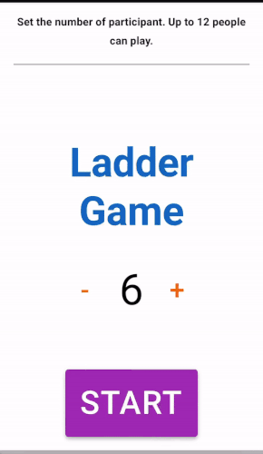
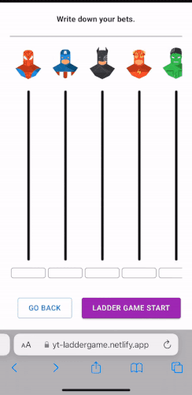
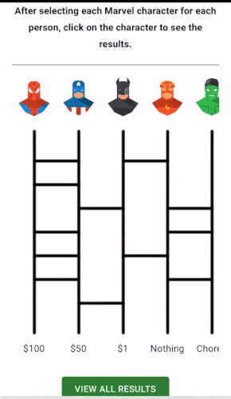

# Ladder Game

A game for 2-12 players that randomly matches the players with an input value takes in an input based on the number of players.
It consists of ladder algorithm that assigns the input values to the player randomly.
It is often used to set prizes or penalties.

This is a 3 week short-term project.

### Live Demo

https://yt-laddergame.netlify.app/

### Screenshots

### Key Features

- Ladder Algorithm using 2-dimensional array, binary system, and Math.random()
- Implementation of ladder game animation using window.requestAnimationFrame()
- Data management with Redux
- Drawing ladders on screen using Canvas API

### Technologies

- React
- Redux
- Material-UI
- Canvas API
